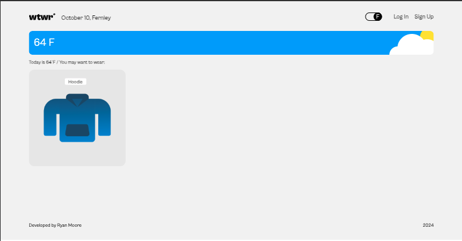
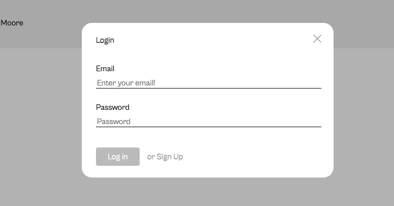

# What to Wear

## Overview

**What to Wear** is a React application that provides clothing recommendations based on the current weather. The app fetches weather data from a weather API and suggests appropriate clothing items that can be added to a MongoDB database.

This project consists of both a front-end (this repository) and a back-end, which handles the database and API logic. The back-end repository can be found [here](https://github.com/moorek11c/se_project_express.git).

## Table of Contents

## Screenshots

### Home Page

### Login Modal

### Sign Up Modal

## Features

- Fetches current weather data using a weather API.
- Filters and suggests clothing items suitable for the weather.
- Allows users to add, like, or remove clothing items from the database.
- Manages user authentication for logging in and managing their clothing collection.
- Uses a modal for user interactions, such as login and adding new items.

## Go to Website

[here](https://checkwtwtoday.crabdance.com/).

## Instructions on deployment

1. Clone the repository.
2. Run `npm install` to install the necessary dependencies.
3. Run `npm start` to start the development server.
4. Open [http://localhost:3000](http://localhost:3000) to view it in the browser.
